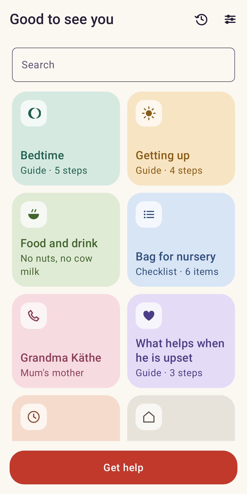
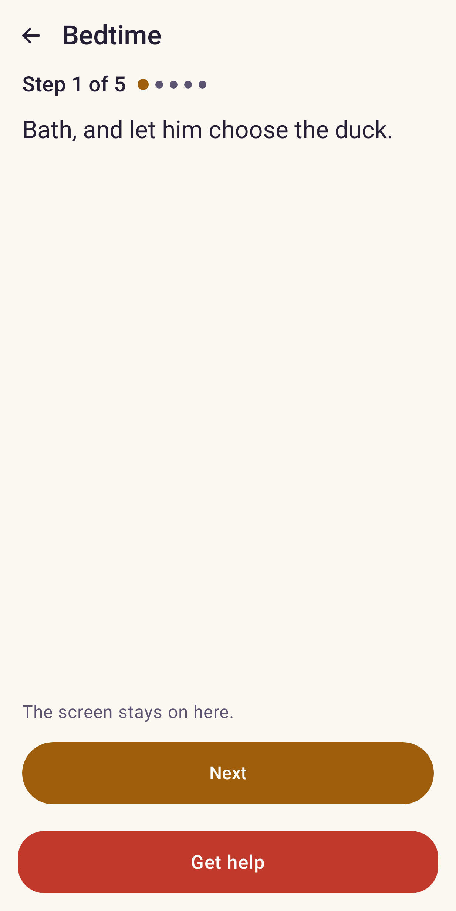
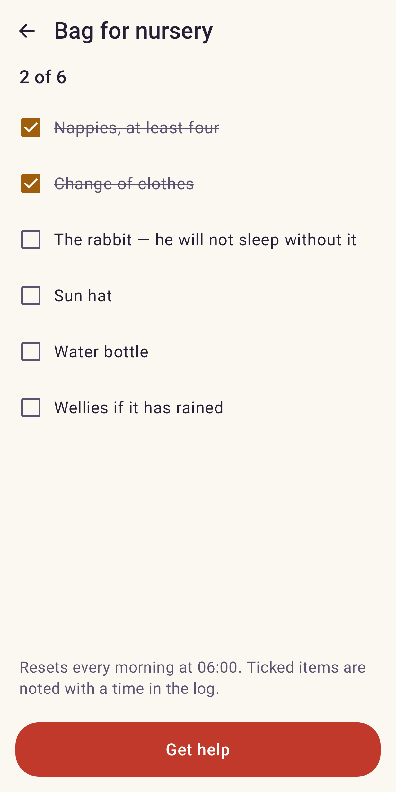
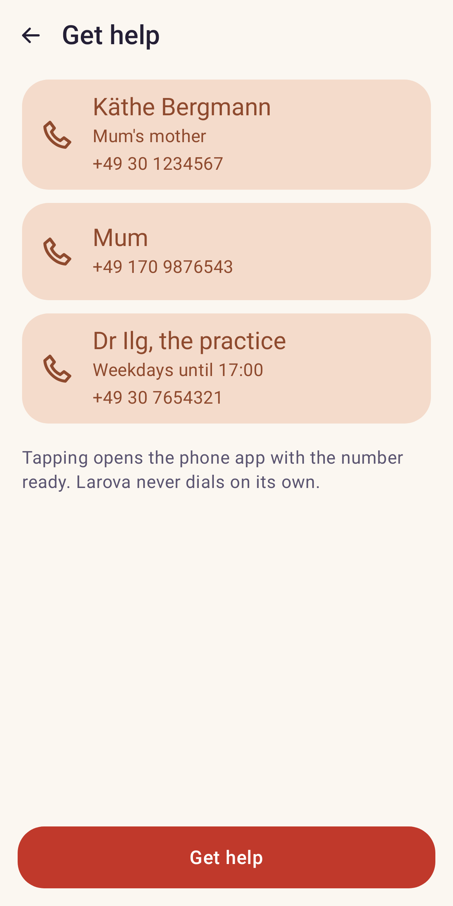
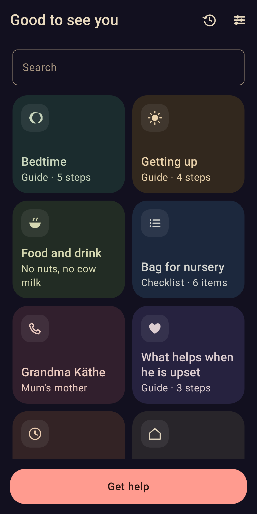

# Larova

**Everything that matters about your child, in a place anyone can understand.**

Larova is an app you set up on your child's phone. You fill it with the things you would otherwise have to explain — how bedtime works, what your child eats, who to call, what helps when they are upset. Grandparents, a babysitter, a daycare teacher or a sports coach open the app, find what they need in two taps, and can reach you immediately if something comes up.

Nothing leaves the device. There is no account, no cloud, and no internet permission.

---

## The name

*Larova* comes from the **Lares**, the household spirits of Roman homes. Their shrine was the *lararium*: a small arched niche in the wall with a lamp that stayed lit while the house was lived in. That niche is the app's icon — a doorway with the light left on. Someone is there, even when you are not.

---

## What it looks like

| Start screen | A guide | A checklist | Get help | Night |
| --- | --- | --- | --- | --- |
|  |  |  |  |  |

Rendered from the app's own code rather than taken by hand, so they cannot drift away from what
it does — see [`AGENTS.md`](AGENTS.md), "Screenshot tests".

---

## What you can put in it

Your start screen is a grid of tiles that you arrange yourself. Each tile holds one kind of thing:

| Tile | What it holds |
| --- | --- |
| **Guide** | Numbered steps, one per screen, each with text and optionally a picture or a recording |
| **Video** | A video from your gallery or one you record on the spot |
| **Audio** | A song, or your own voice |
| **Note** | Free text with headings and bullet points |
| **Checklist** | Items to tick off, optionally resetting each morning |
| **Table** | Columns and rows you define yourself |
| **Call** | A name, a number and a photo — one tap to dial |
| **Website** | A link that opens in the browser |
| **App shortcut** | Opens another app already installed on the phone |
| **Folder** | Groups tiles together |

Everything inside a tile is written by you. Larova provides the shape; you provide the content.

---

## Two views

**Caregiver view** is what the app normally shows. Read, tick things off, make a call, open a link. Nothing can be changed, moved or deleted by accident.

**Parent view** unlocks with a PIN or your fingerprint. Only here do the edit handles, the plus button and the backup options appear. After five minutes without input, the app returns to caregiver view on its own.

This is the single most important thing about how Larova works. It means you can hand the phone to anyone without a word of explanation.

---

## Getting help

A bar sits at the bottom of every screen: **Get help**. Behind it are the numbers you chose, shown large, with a photo and a relation — "Mum", "Dad", "Dr Keller", "112".

Tapping one opens the phone app with the number ready. It never dials on its own, and it never sends your location anywhere. The person holding the phone decides.

---

## Your data stays yours

Larova stores everything on the device and nowhere else. It has no account system, no analytics and no internet permission at all. Nothing you write is ever sent to us, because there is no "us" to send it to.

**Backing up and handing over.** One menu item creates a single file containing all your tiles, pictures and recordings. You choose where it goes — the phone itself, Google Drive, Nextcloud, a USB stick, whatever is installed. The same file works as a handover package: send it to your partner or the other grandparent, they open it in their own copy of Larova, and everything is there. You can protect it with a password, which we recommend whenever the file leaves your hands.

**What happened while you were away.** Larova quietly notes when a tile was opened and when a checklist item was ticked, so you can look back in the evening. Caregivers can add their own notes too. This log stays on the device, is kept for 30 days by default, and can be cleared at any time.

---

## Light, dark and night

Three appearance settings. The third one exists for a specific reason: reading a bedtime guide aloud in a darkened room with a white screen does not work. **Night** uses warm amber on near-black, dims the display and avoids bright surfaces entirely, so nobody wakes up.

---

## Languages

Larova speaks English, German, French, Italian, Spanish, Portuguese, Ukrainian, Polish, Russian, Turkish, Arabic, Hindi, Chinese and Japanese.

You can set the app's language **independently of the phone's language**. That matters: a grandmother who does not read German can put Larova into Turkish while her grandchild's phone stays in German.

The app is translated. What you write is not — your own words stay exactly as you wrote them, and are never sent anywhere to be translated.

---

## What Larova is not

Larova is a notebook. It does not diagnose anything, does not calculate doses, does not interpret anything you write, and does not give advice. If you use it to note down what a caregiver should know about your child's health, that note is your text, the same as the one you would tape to the fridge — Larova just carries it and shows it to the right person at the right moment.

**It is not a medical device, and it is not an emergency service.** In an emergency, call your local emergency number.

---

## Platforms

Android first. iOS is planned but not scheduled.

---

## Licence

Larova is free software under the **GNU Affero General Public License v3.0**. You may use, study, share and modify it. If you distribute a modified version, it has to stay free under the same terms.

See [`LICENSE`](LICENSE) for the full text.

---

## Documentation

Everything behind the app lives in [`docs/`](docs/) — the product concept, the implementation plan, technical notes, the localization plan and the design system.
